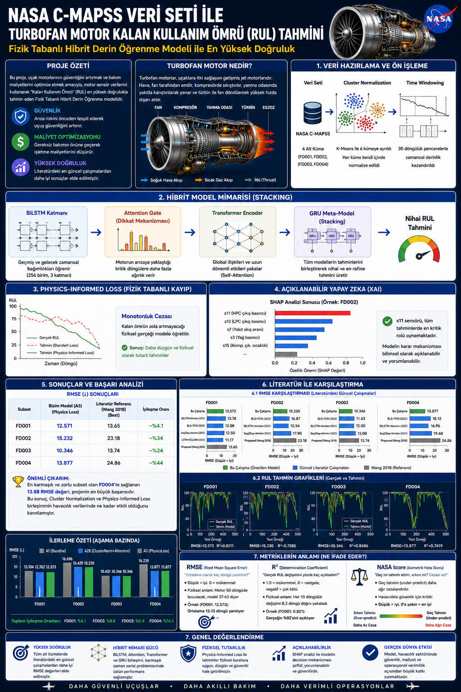
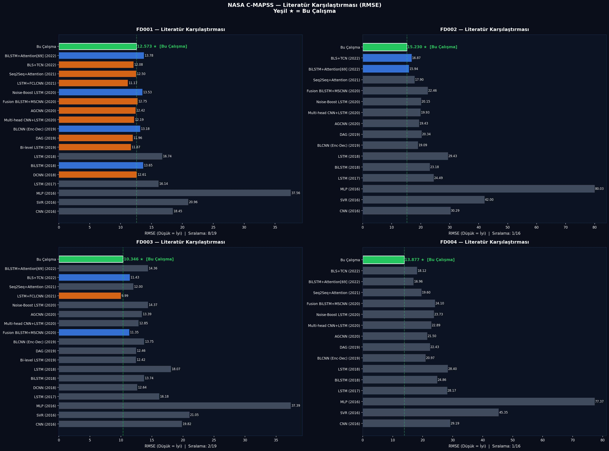
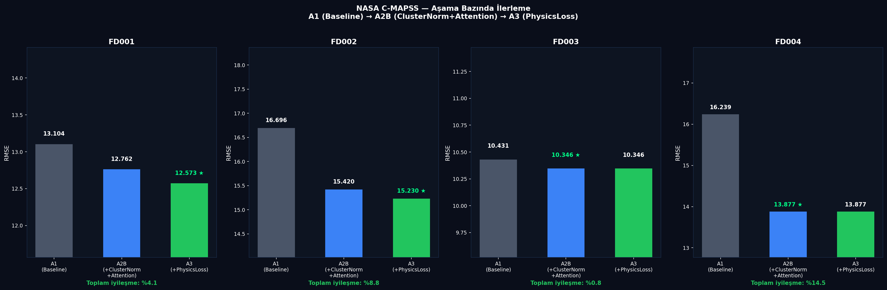
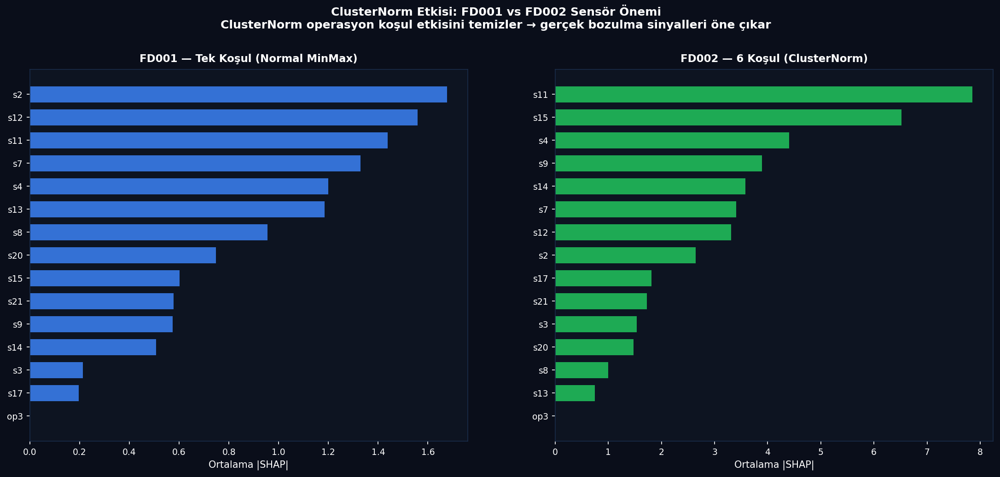

# README.md

# NASA C-MAPSS Turbofan Motor RUL Tahmini

Physics-Informed Hibrit Derin Öğrenme modeli ile turbofan motorlarının Kalan Kullanım Ömrü (RUL) tahmini gerçekleştirilmiştir.

---

# Poster



---

# Proje Özeti

Bu projede NASA C-MAPSS turbofan motor veri seti kullanılarak uçak motorları için Remaining Useful Life (RUL) tahmini gerçekleştirilmiştir.

Model yapısında:

* BiLSTM + Attention
* Transformer Encoder
* GRU Stacking Ensemble
* Physics-Informed Loss
* SHAP Explainability

yaklaşımları birlikte kullanılmıştır.

Özellikle FD002 ve FD004 subsetlerinde literatürdeki güncel çalışmalar arasında düşük RMSE sonuçları elde edilmiştir.

---

# Sonuçlar

| Subset | RMSE   | R²    |
| ------ | ------ | ----- |
| FD001  | 12.573 | 0.821 |
| FD002  | 15.230 | 0.758 |
| FD003  | 10.346 | 0.848 |
| FD004  | 13.877 | 0.741 |

---

# Literatür Karşılaştırması



---

# Model Gelişim Süreci



---

# SHAP Sensör Analizi



---

# Kullanılan Teknolojiler

* Python
* PyTorch
* NumPy
* Pandas
* Scikit-learn
* SHAP
* Matplotlib
* Google Colab (T4 / L4 GPU)

---

# Proje Yapısı

```text
kod/
 ├── cmapss_asama1
 ├── cmapss_asama2a
 ├── cmapss_asama2b
 ├── cmapss_asama2c
 ├── cmapss_asama3
 └── cmapss_final

rapor/
 ├── proje_raporu.pdf
 ├── poster.pdf
 └── poster.png
```

---

# Poster ve Rapor

[Poster PDF](rapor/afiş.pdf)

[Proje Raporu PDF](rapor/241478117AyşeATMACA.pdf)

---

# Proje Sahibi

Ayşe Atmaca
